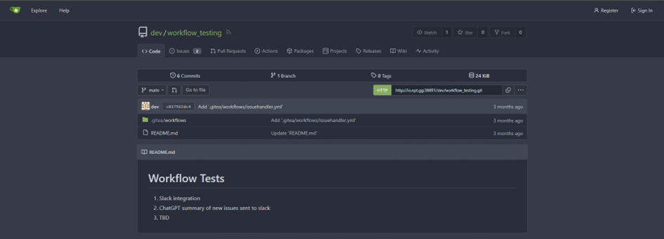
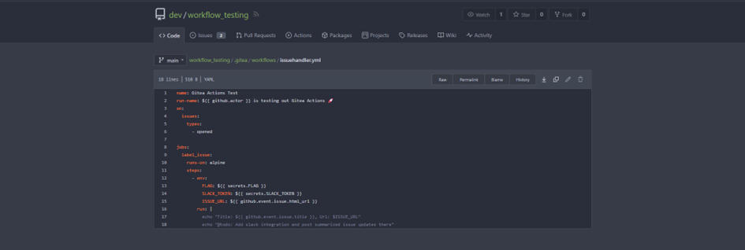

# Challenge Write-up: POISONPWN
## By starsiv

### Description
CICD's automation is great and comfy, but I sense a chilly draft. Can you find the way in?

URL: `io.ept.gg:#####`

### Solve
**By Hansern**

#### Key Findings
The most interesting thing found around the site is the git repo `dev/workflow_testing`. Since the user is `dev`, there must be something cool. This proved true as inside the mentioned repo lies an `issuehandler.yml` file. This file is an issue handler for GitHub Actions – a CI/CD platform allowing GitHub developers to automate development workflows easily. The convenience of GitHub Actions often makes it vulnerable.



#### Discovering the Vulnerability
Upon reading this `yml` file, we notice where the flag is located. It is in the environment variable `FLAG`. In addition, the issue handler runs two `echo` commands, one of which uses an environment variable we can manipulate, namely the title (`${{ github.event.issue.title }}`).




#### Confirming the Injection Point
This can be confirmed by looking at previous actions performed by the user `Dev`. There, we see that the title in the `echo` matches the corresponding Issue. Thus, we need to inject a command in the title of an Issue. More information on this type of vulnerability can be found at [Cycode's blog on GitHub Actions vulnerabilities](https://cycode.com/blog/github-actions-vulnerabilities/).


#### Executing the Attack
The best approach is to execute a reverse shell with ngrok. By crafting an Issue with a title that includes a reverse shell command, we can exploit the vulnerability in the `issuehandler.yml`.

#### Reverse Shell Command
We can use a reverse shell command like the following to exploit the vulnerability:


```bash
FLAG=EPT{53CUr3_Y0Ur_4C710N5?}
```

#### Result
By injecting this command into the title of a GitHub Issue, the GitHub Actions workflow is triggered. The `echo` command, which includes the manipulated title, executes our reverse shell command, revealing the environment variable `FLAG` containing the flag.

### Conclusion
This challenge demonstrated the importance of securing CI/CD pipelines, especially in automated workflows like GitHub Actions. The ease of automation can often lead to overlooked vulnerabilities, making it essential to thoroughly review and secure all parts of the development and deployment process.
